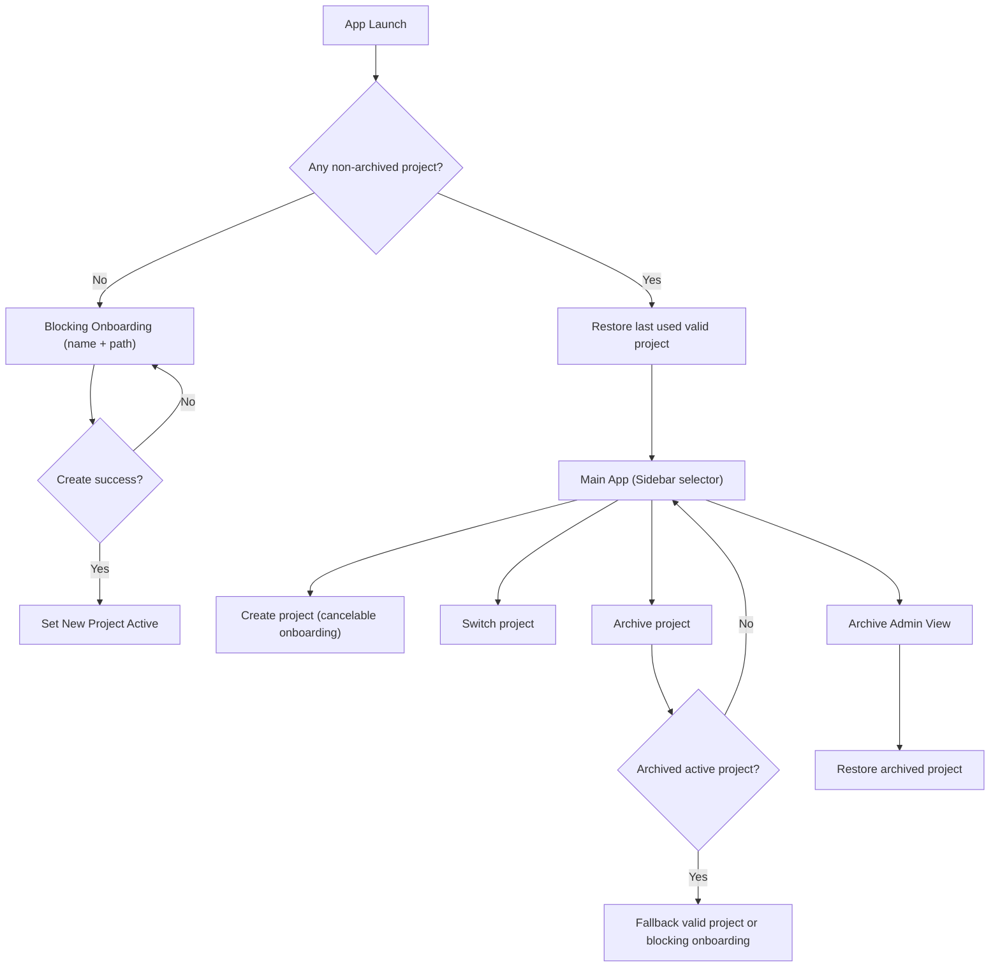
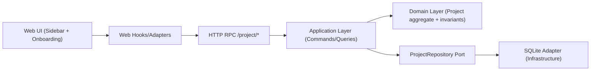

# ADR: Project Entity Foundation

- Status: Accepted
- Date: 2026-03-08
- Scope: Initial `Project` entity and workflow foundation

## 1. Context
Storik needs a parent entity to scope tickets and agents. The system currently has minimal API/Web scaffolding and no implemented project slice. This ADR defines the first architecture decisions for project creation, activation, and lifecycle in a single-user local environment.

## 2. Decision Summary
- Use `Project` as the aggregate root for workspace context.
- Store project state in API as source of truth, persisted in local SQLite.
- Expose project operations through RPC-style endpoints under `/project/*`.
- Keep strict DDD/CQRS/hexagonal boundaries:
  - Domain: entities, invariants, repository contracts.
  - Application: commands and queries.
  - Infrastructure: SQLite repository and HTTP adapters.
- Enforce path validation on create and activate.
- Use soft delete (`deletedAt`) for archive behavior.

## 3. Product Workflow (Architecture-Relevant)

## 4. Layered Architecture

## 5. Domain Model and Invariants
### 5.1 Entity Shape
- `id: ProjectId`
- `name: string`
- `path: string`
- `createdAt: DateTime`
- `updatedAt: DateTime`
- `deletedAt: DateTime | null`
- `lastUsedAt: DateTime | null`

### 5.2 Invariants
- `name` must be trimmed and 1 to 80 chars.
- `path` must be absolute, existing, and git-backed (`.git` present).
- `path` must be unique across active and archived records.
- `path` is immutable after creation in v1.
- Child resources must reference a non-archived project.

## 6. CQRS Inventory
### 6.1 Commands (Mutations)
- `CreateProject`
- `RenameProject`
- `SelectActiveProject`
- `ArchiveProject`
- `RestoreProject`

### 6.2 Queries (Reads)
- `ListProjects` (active + invalid status info)
- `ListArchivedProjects`
- `GetActiveProject`

## 7. RPC API Shape
- `POST /project/create`
- `POST /project/rename`
- `POST /project/select`
- `POST /project/archive`
- `POST /project/restore`
- `GET /project/list`
- `GET /project/list-archived`
- `GET /project/active`

The endpoint layer stays thin and delegates to application handlers only.

## 8. Persistence Strategy
- Backend persistence: local SQLite.
- API is system of record for projects and active selection metadata.
- SQLite constraints must enforce unique `path`.
- Soft delete uses `deletedAt` timestamp; no hard delete in v1.

## 9. Validation and Security Baseline
- Canonicalize incoming paths before checks.
- Validate path at creation and at project activation.
- Mark projects invalid when current path fails validation; block activation.
- Avoid machine-wide path scanning or automatic repo discovery in onboarding.
- Return neutral error messages that do not leak unnecessary filesystem details.

## 10. Consequences
### Positive
- Clear ownership model for tickets and agents.
- Safe lifecycle with restore capability.
- Architecture stays aligned with feature slices and ports/adapters.

### Tradeoffs
- No path edit flow in v1 means archive + recreate for path changes.
- Invalid-path projects may require manual user intervention.
- RPC endpoints require explicit command/query mapping discipline.

## 11. Test Scenarios
- Create first project from blocking onboarding.
- Reject duplicate path.
- Reject non-absolute/non-existing/non-git path.
- Select valid project and persist active context.
- Rename project name only.
- Archive active project and verify fallback behavior.
- Restore archived project from archive administration view.
- Block activation for invalid path project.
- Verify onboarding does not include auto-detected repository suggestions.

## 12. Explicit Exclusions
- Authentication.
- Multi-tenant architecture.
- Remote synchronization.

